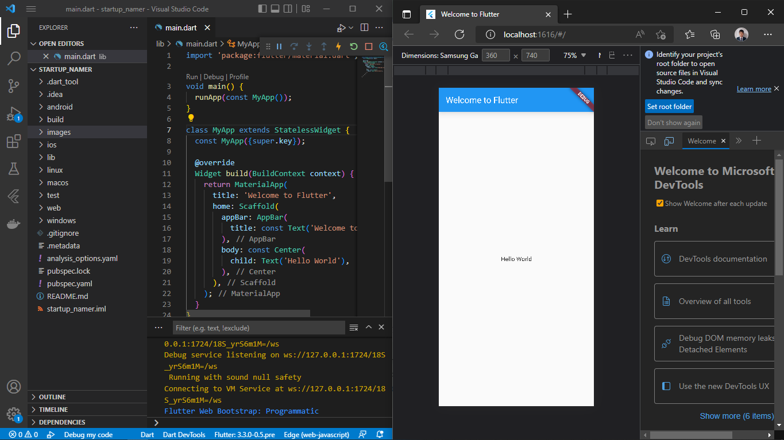
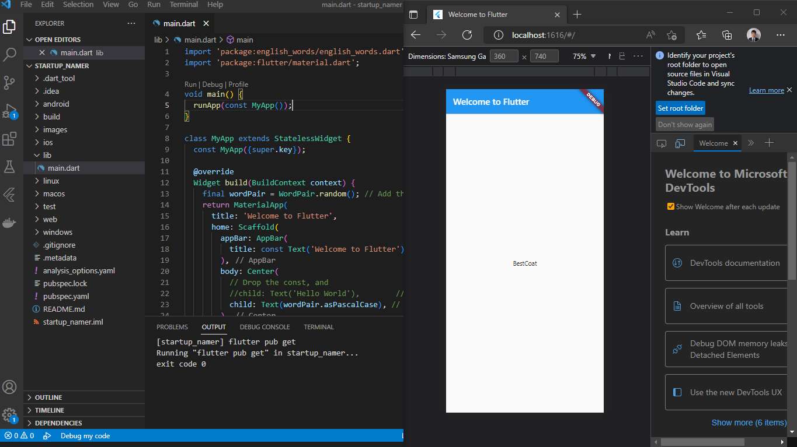
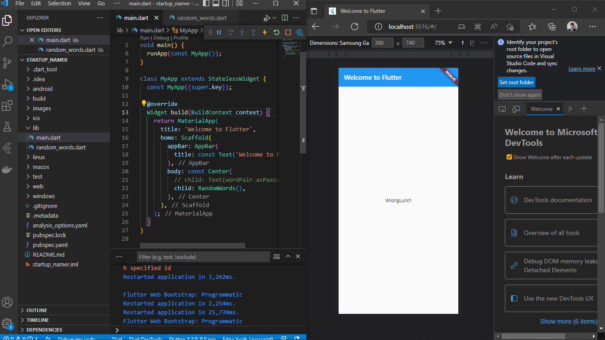
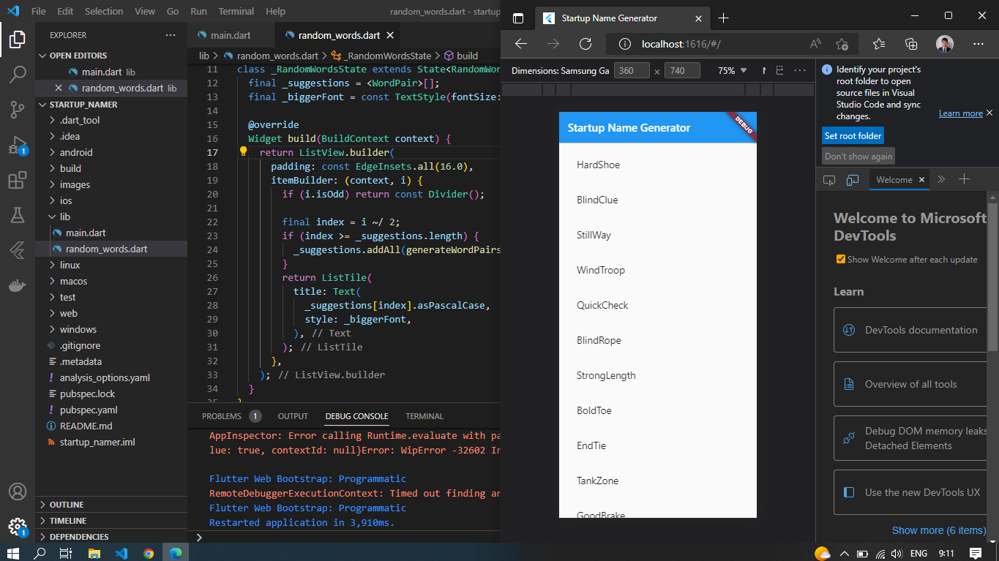
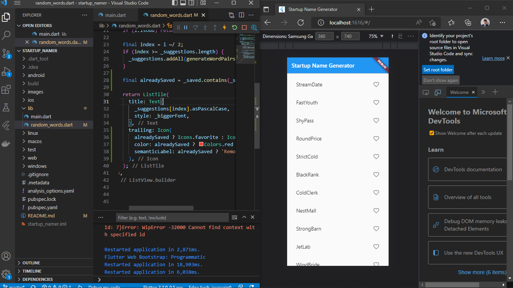
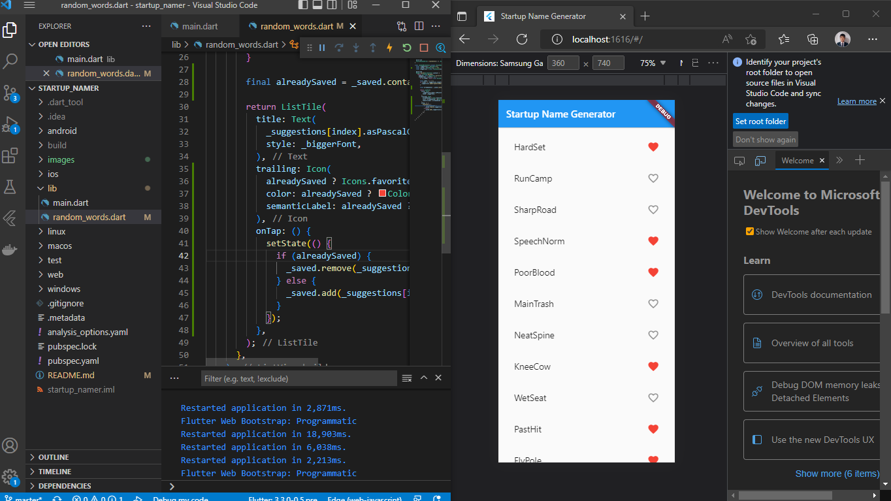
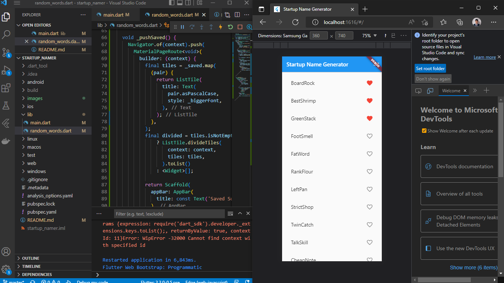
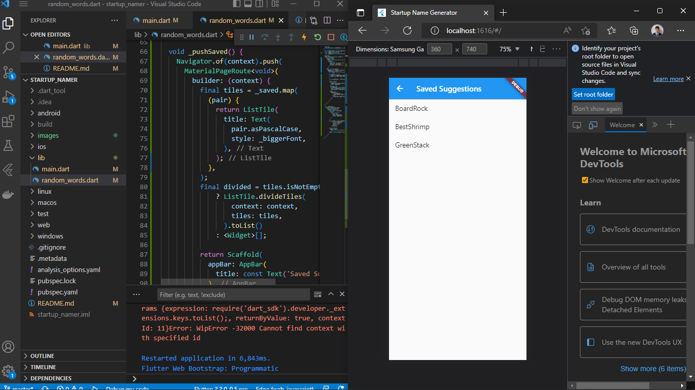
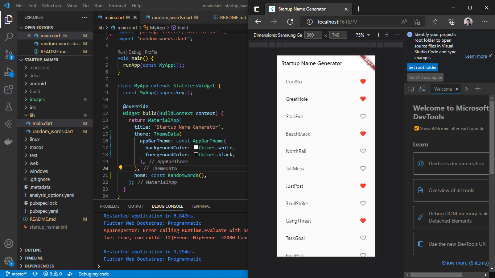

# TSA Mobile

A new Flutter project.

## Part 1
### Create the starter Flutter app

### Use an external package

### Add a stateful widget

### Create an infinite scrolling ListView

## Part 2
### Add icons to the list

### Add interactivity

### Navigate to a new screen

### Change the UI using themes

## Part 3
